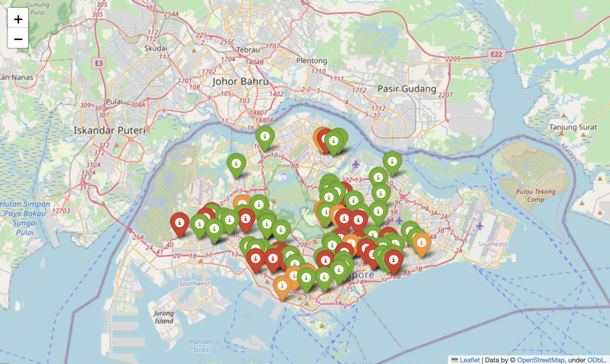

# AIAP Batch 13 Group 1 Sharing on Langchain

## 1.0 Folder Structure

```
-AIAP13_GROUP1_SHARING
├── README.md
├── article.md
├── data
│   ├── Data.csv
│   ├── data_analysis
│   │   └── Angel-Hsu-SG-Chicken-Rice-dataset.csv
│   ├── deeplearningai
│   │   └── OutdoorClothingCatalog_1000.csv
│   └── qna_doc_retrieval
│       ├── embeddings
│       └── raw
│           ├── nvidia_q4_2023_earnings_call_transcript.txt
│           └── tsla_earnings_transcript_q4_2022.txt
├── images
├── notebooks
│   ├── data_analysis
│   │   ├── LangChain_PandasDataFrame_Agent_part1.ipynb
│   │   └── LangChain_PandasDataFrame_Agent_part2.ipynb
│   ├── deeplearningai
│   │   ├── Langchain_DLAI_L1_Model_Prompts_Parsers.ipynb
│   │   ├── Langchain_DLAI_L2_Memory_Types.ipynb
│   │   ├── Langchain_DLAI_L3_Chains.ipynb
│   │   ├── Langchain_DLAI_L4_Q&A_over_Documents.ipynb
│   │   ├── Langchain_DLAI_L5_Evaluation.ipynb
│   │   └── Langchain_DLAI_L6_Agents.ipynb
│   ├── memory_examples
│   │   └── memory_examples.ipynb
│   └── qna_doc_retrieval
│       └── qna_doc_retrieval.ipynb
└── src
    └── app.py
```

## 2.0 Article

```
-AIAP13_GROUP1_SHARING
│   ...
├── article.md
│   ...
```

The article discusses LangChain, a library designed to enhance the usage and integration of large language models (LLMs) in various applications. The article also discusses how LangChain addresses several challenges associated with LLMs, such as repetitive boilerplate text in prompts, unstructured responses, LLM ecosystem switching, short memory of LLMs, integration into pipelines, and passing data to LLMs.

Code snippets are available within the article to illustrate how some of the modules in LangChain work. Jupyter notebooks with full examples are also provided in the "notebooks" folder.

## 3.0 Jupyter Notebooks

The "notebooks" folder contains four sub-folders. Each of these sub-folder contains full examples to demonstrate how LangChain works and its various use-cases.

```
-AIAP13_GROUP1_SHARING
│   ...
├── notebooks
│   ├── data_analysis
│   │   ├── LangChain_PandasDataFrame_Agent_part1.ipynb
│   │   └── LangChain_PandasDataFrame_Agent_part2.ipynb
│   ├── deeplearningai
│   │   ├── Langchain_DLAI_L1_Model_Prompts_Parsers.ipynb
│   │   ├── Langchain_DLAI_L2_Memory_Types.ipynb
│   │   ├── Langchain_DLAI_L3_Chains.ipynb
│   │   ├── Langchain_DLAI_L4_Q&A_over_Documents.ipynb
│   │   ├── Langchain_DLAI_L5_Evaluation.ipynb
│   │   └── Langchain_DLAI_L6_Agents.ipynb
│   ├── memory_examples
│   │   └── memory_examples.ipynb
│   └── qna_doc_retrieval
│       └── qna_doc_retrieval.ipynb
│   ...
```

### 3.1 Folder: data_analysis

The data_analysis folder contains examples on how LangChain can be used to prompt LLMs to perform data analysis by reading data that resides in .csv files.

### 3.2 Folder: deeplearningai

The deeplearningai folder contains teaching materials by DeepLearning.AI on how LangChain works.

Link to lesson 1:  
https://learn.deeplearning.ai/langchain/lesson/1/introduction

### 3.3 Folder: memory_examples

The memory_examples folder contains examples on how the different memory components within LangChain works.

### 3.4 Folder: qna_doc_retrieval

The qna_doc_retrieval folder contains examples on how LangChain can be used to prompt LLMs to extract information from user-owned text documents, and to allow users to ask questions specific to the documents.

## 4.0 Instructions for Running the Streamlit App

```
-AIAP13_GROUP1_SHARING
│   ...
└── src
    └── app.py
```

The streamlit app provides the front-end interface for interacting with the geo-spatial data analysis of e-coli levels in chicken rice from stalls around singapore, which was supported by LLM and LangChain.



You can run the streamlit app by running the following in your terminal:

```
python src/app.py
```
