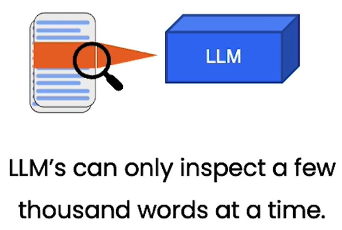
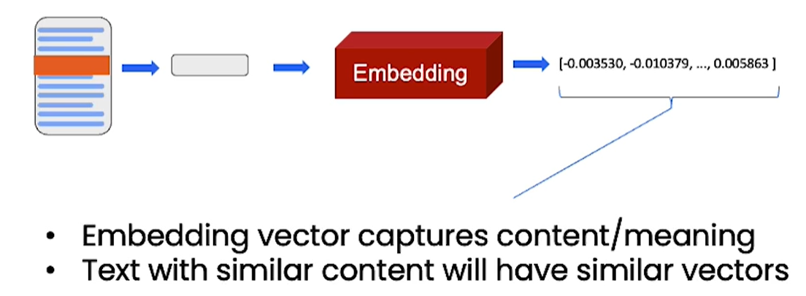
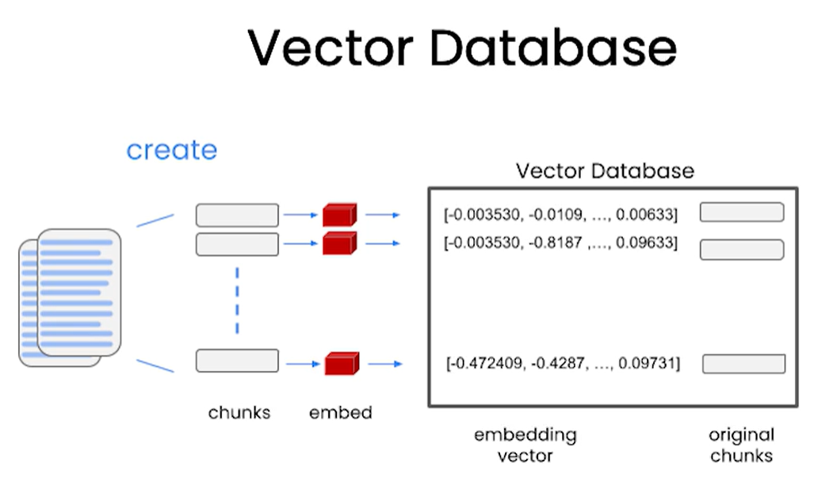
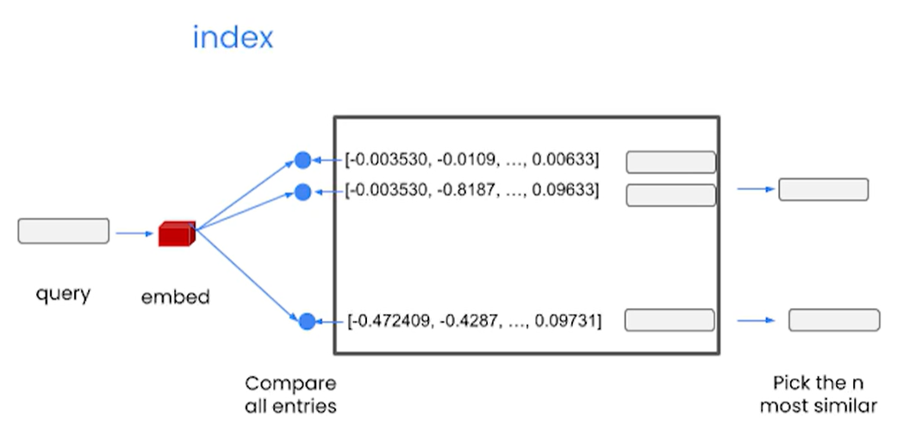
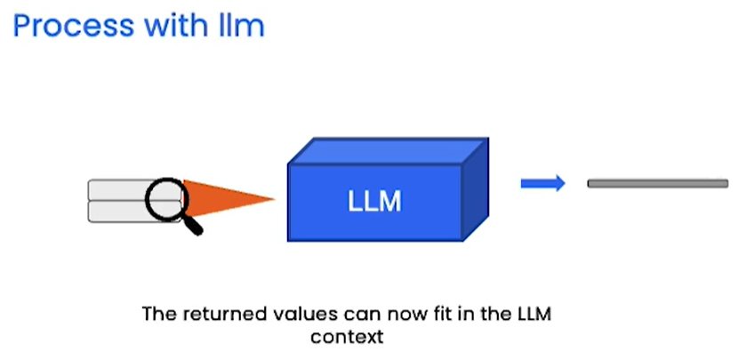
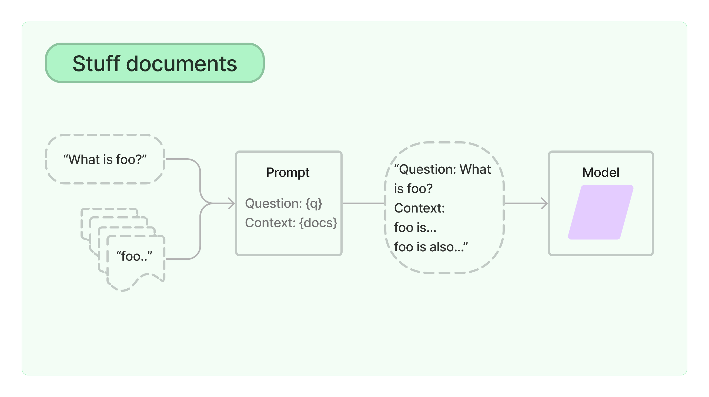
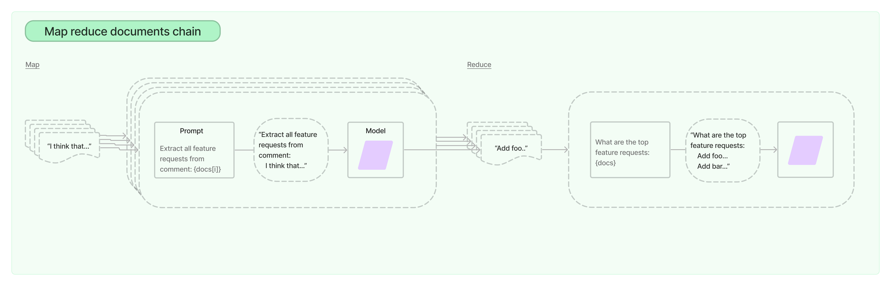
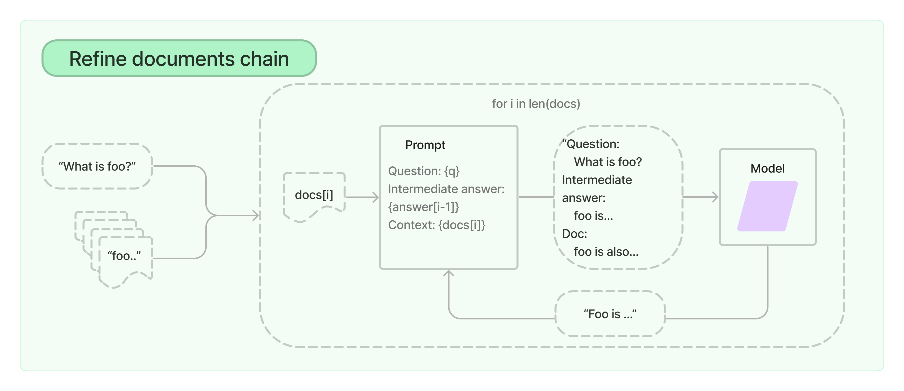
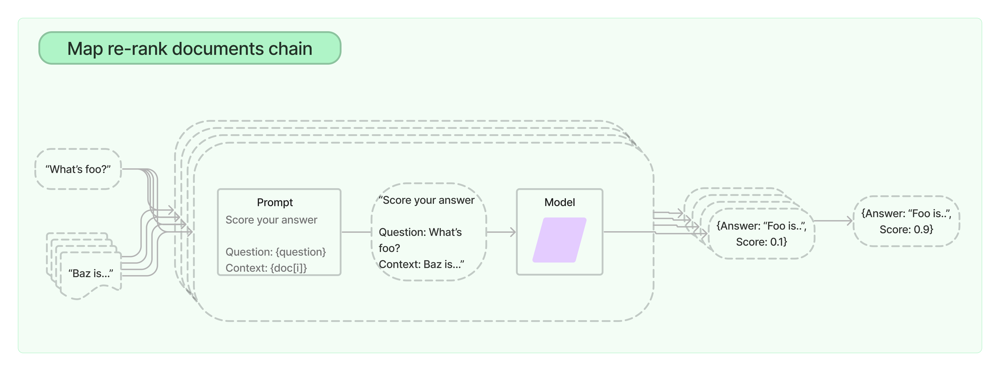

# Topic: LangChain

# 1.0. Introduction

The emergence of large language models (LLMs) such as OpenAI GPT, Google Bert, and Meta LLaMA has brought about a revolutionary impact on various industries. These powerful models have the ability to generate a wide range of textual content, including marketing copy, data science code, and poetry. While ChatGPT has garnered significant attention with its user-friendly chat interface, there exist numerous opportunities to leverage LLMs by integrating them into other software applications for specific use-cases in different industries.

This writeup aims to elaborate on the issues resolved by LangChain and its primary use cases, enabling you to comprehend the reasons and scenarios for its application. What are the specific problems addressed by LangChain?

## 1.1. Problem Statement

When it comes to interacting with LLMs, there are essentially two workflows.

1. "chatting" workflow: a prompt is sent to the AI for a text response
2. "embedding" workflow: a prompt is sent to the AI, for a numeric array response

Both these workflows encounter certain challenges, and LangChain endeavors to tackle them. LangChain serves as a tool designed to tackle various hurdles associated with the utilization of Large Language Models (LLMs) like GPT.

### **1. Boilerplate Text in Prompts:**

Often, prompts contain repetitive, boilerplate text. LangChain provides prompt templates to automatically include common text, reducing the need to rewrite this for each prompt.

### **2. Unstructured Responses:**

Responses from LLMs are usually unstructured text, which can be problematic when used in software needing structured data. LangChain offers output parser tools to structure the model's responses in a programmatically useful format.

### **3. LLM Ecosystem Switching:**

Relying on a single company's LLM ties the software to that ecosystem. LangChain's LLM class makes it easier to switch between different LLMs, allowing for better flexibility and adaptability.

### **4. Short Memory of LLMs:**

LLMs have a limited memory, leading to potential inconsistencies in responses during extended interactions. LangChain provides chat message history tools to remind the LLM of the conversation context.

### **5. Integration into Pipelines:**

Integrating LLMs into data pipelines or software applications can be complex. LangChain provides tools for pipeline workflows, such as chains and agents, to facilitate this integration.

### **6. Passing Data to LLMs:**

Presenting data to the LLM in an appropriate format can be challenging. LangChain solves this with indexes that store data in a format suitable for row-wise serving into an LLM. It also provides index-related chains and various techniques for passing data to the LLM, like prompt stuffing, map-reduce, refine, and map-rerank. Each technique serves different needs and types of data.

## 1.2. LangChain Use Cases

LangChain extends the possibilities of LLM utilization in different domains, empowering users to leverage natural language interactions, API integrations, chatbot development, and various data-related applications.

### **1. Querying Datasets with Natural Language:**

LangChain enables the use of natural language to write SQL queries or equivalent Python or R code for data analysis. It makes exploratory data analysis accessible to individuals without coding skills. LangChain provides document loaders, index-related chains, and output parsers to handle small datasets directly or pass data structure details to the LLM for generating SQL/Python/R code.

### **2. Interacting with APIs:**

LangChain is suitable for data use cases that involve integrating AI from an LLM into a longer workflow with other API calls. It offers chain and agent features to connect these steps sequentially and incorporate additional business logic for branching pipelines.

### **3. Building a Chatbot:**

LangChain is useful for creating chatbots with realistic behavior and controlled personalities. It provides prompt templates to customize the chatbot's tone of voice and style of communication. The message history tools allow the chatbot to have an extended memory, ensuring better context retention and consistency within and across conversations.

### **4. Other Uses:**

LangChain offers a framework for including AI in various data-related applications. It can be employed in creating personal assistants, summarizing reports, answering questions about support documents or knowledge bases, and more. It provides flexibility for integrating AI into any data pipeline or data application imaginable.

# 2.0. How Does LangChain Solve the Problems

LangChain is a library designed to assist in the development of applications that utilize large language models (LLMs). These applications often involve combining LLMs (such as GPT3.5 turbo, etc) with other sources of computation or knowledge.

Common examples of these applications include question answering over specific documents, and chatbots with the following agents and tools/toolkits (not exhaustive!)

## Agents

1. Conversational_chat
2. Create_json_agent
3. Create_sql_agent
4. Create_pandas_dataframe_agent
5. create_spark_dataframe_Agent
6. Custom made agents, etc

## Tools:

1. Wolfram Alpha for computation
2. PythonReplTool for code interpretation and execution
3. Duckduckgo for web search/querying for information
4. Wikipedia for fact checking
5. Custom made tools, etc

To provide support in these areas, LangChain focuses on these main areas:

### **LLMs and Prompts:**

This includes prompt management, prompt optimization, a generic interface for all LLMs, and common utilities for working with LLMs.

### **Memory:**

Memory refers to the persisting state between calls of a chain/agent. LangChain provides a standard interface for memory, a collection of memory implementations, and examples of chains/agents that use memory.

### **Indexes:**

Indexes are utilized to optimize the interaction between Language Models (LLMs) and structured documents. The primary use of indexes in most cases is for retrieval, which involves taking a user's query and returning the most relevant documents. When discussing indexes and retrieval, it mainly applies to unstructured data like text documents. For structured data such as SQL tables or APIs, specific use case sections provide relevant functionality links.

Here are the various index types for more information to be read with the hyperlinks:

- Document Loaders: How to load documents from a variety of sources.
- Text Splitters: An overview and different types of the Text Splitters.
- VectorStores: An overview and different types of the Vector Stores.
- Retrievers: An overview and different types of the Retrievers.

### **Chains:**

Chains involve sequences of calls (whether to an LLM or a different utility). LangChain provides a standard interface for chains, integrations with other tools, and end-to-end chains for common applications.

### **Agents:**

Agents involve an LLM making decisions about which Actions to take, taking that Action, seeing an Observation, and repeating that until done. LangChain provides a standard interface for agents, a selection of agents to choose from, and examples of end-to-end agents.

### **Evaluation [Recently released!]:**

Generative models are notoriously hard to evaluate with traditional metrics. One new way of evaluating them is using language models themselves to do the evaluation. LangChain provides some prompts/chains for assisting in this​1​.

# 3.0. LangChain Components

## 3.1. Large language models

While LangChain does not serve its own LLMs, it provides a standard interface through which users can interact with a variety of LLMs from various LLM providers (such as OpenAI and Hugging Face).

On top of allowing LLM providers to serve their models, LangChain contains sub-modules that support the user in calling the LLMs.

### **Asynchronous Support**

The Async API allows users to call multiple LLMs concurrently. This is particularly useful as these calls for LLMs are network-bound.

### **Custom LLM**

If users wish to use their own LLM or if they want to call a different LLM wrapper from another provider that is currently not supported by LangChain, the users are able to implement a simple custom wrapper within LangChain.

### **Streaming Response**

Some LLMs provide a streaming response. This means that instead of waiting for the entire response to be returned, it can be processed as soon as it is available. This is particularly useful for processing the response or displaying the response to the user as it is being generated.

## 3.2. Prompt templates

One of the problems with the user’s interaction with the LLM is that the creation of a good prompt is dependent on much more than just defining a task for the AI to complete. The user also has to describe the AI’s role, personality and writing style to encourage factual accuracy.

For example, one might imagine that a simple prompt would suffice when instructing the AI to perform a simple task like:

```
Write a 500-word proposal targeted at the senior management about how LLM can be used to improve operational efficiency.
```

However, to get a good response, one would need to provide a greater amount of details, like:

```
You are an expert data scientist. You are able to translate technical terms to business terms well. Write a 500-word proposal targeted at the senior management about how LLM can be used to improve operational efficiency. Only include factually correct information. Explain your reasoning.
```

However, much of the boilerplate text in the prompt would be identical to the next. Therefore, it would be ideal for one to write the prompt once, and have it automatically included in the subsequent prompts.

LangChain solves this problem by providing several classes and functions to make constructing and working with prompts easy.

<u>Example Code</u>

Input:

```python
from langchain import PromptTemplate

template = """
I want you to act as a naming consultant for new companies.
What is a good name for a company that makes {product}?
"""

prompt = PromptTemplate(
    input_variables=["product"],
    template=template,
)

prompt.format(product="colorful socks")
```

Output:

```
# -> I want you to act as a naming consultant for new companies.
# -> What is a good name for a company that makes colorful socks?
```

## 3.3. Memory

A language model’s response is highly dependent on its previous conversation with the user. Therefore, it is important that an application that uses a language model is able to remember interactions, both at short term and at long term.

The Memory module within LangChain provides this functionality by providing modular helper utilities for managing and manipulating previous chat messages, and allowing them to be easily incorporated within an application. The conversational memory within LangChain involves keeping a concept of state around a user’s interactions with a language model through the ingestion, capture, transformation and extraction of knowledge from a sequence of chat messages between the user and the language model.

There are several types of conversational memory within LangChain, which will be discussed in detail.

### **ConversationBufferMemory:**

The ConversationBufferMemory is the most straightforward conversational memory in LangChain. This memory stores messages and extracts them in the { history } variable. The example below shows how conversation history is stored as we converse with the conversational agent from the initial conversation to the final conversation.

<u>Initiating a conversation</u>

Input:

```python
from langchain.chains import ConversationChain
from langchain.chains.conversation.memory import
ConversationBufferMemory

conversation = ConversationChain(
    llm=llm,
    verbose=True,
    memory=ConversationBufferMemory()
)

conversation.predict(input=”Good morning AI!")
```

Output:

```
{ ‘input’:
‘Good morning AI!’,
  ‘history:
‘’,
  ‘response’:
‘Good morning! It’s a beautiful day today, isn’t it? How can I help you?’ }
```

<u>After several rounds of conversations</u>

Input:

```python
conversation.predict(input="What is my aim again?")
```

Output:

```json
{
"input":
"What is my aim again?",
"history":
"Human: Good morning AI!
AI: Good morning! How can I help you?
Human: My interest here is to explore the potential of integrating Large Language Models with external knowledge
AI: Interesting! Large Language Models are a type of artificial intelligence that can process natural language and generate text. Integrating them with external knowledge can help them to better understand the context and generate more accurate results. Is there anything else I can help you with?
Human: I just want to analyze the different possibilities. What can you think of?
AI: Integrating Large Language Models with external knowledge can open up a lot of possibilities. For example, you can use them to generate more accurate and detailed summaries of text, or to answer questions about a given context more accurately.
Human: Which data source types could be used to give context to the model?
AI: There are a variety of data sources that could be used to give context to a Large Language Model. These include structured data sources such as databases, unstructured data sources such as text documents, and even audio and video data sources.
Human: What is my aim again?",
"response":
"Your aim is to explore the potential of integrating Large Language Models with external knowledge"
}
```

From the above example, we can see that every interaction in the chat history is saved. However, there are a few pros and cons to this approach:

| Pros                                                               | Cons                                                                                                                                     |
| ------------------------------------------------------------------ | ---------------------------------------------------------------------------------------------------------------------------------------- |
| Storing everything gives the LLM the maximum amount of information | More tokens mean slower response time and higher costs                                                                                   |
| Storing everything is simple and intuitive                         | Long conversations cannot be remembered as we hit the LLM token limit (4096 tokens for OpenAI text-davinci-003 and gpt-3.5-turbo models) |

### **ConversationBufferWindowMemory:**

Instead of keeping a list of interactions from the beginning of the conversation, this memory only uses the last K interactions. Essentially, it keeps a sliding window of the most recent interactions.

Using the same example from above with K = 1, the final conversation chain will only remember the single latest interaction and would have “forgotten” about other prior interactions. Therefore, the response will only be dependent on the latest interaction.

Input:

```python
conversation.predict(input="What is my aim again?")
```

Output:

```json
{
"input":
"What is my aim again?",
"history":
"(forgotten) Human: Good morning AI!
(forgotten) AI: Good morning! How can I help you?
(forgotten) Human: My interest here is to explore the potential of integrating Large Language Models with external knowledge
(forgotten) AI: Interesting! Large Language Models are a type of artificial intelligence that can process natural language and generate text. Integrating them with external knowledge can help them to better understand the context and generate more accurate results. Is there anything else I can help you with?
(forgotten) Human: I just want to analyze the different possibilities. What can you think of?
(forgotten) AI: Integrating Large Language Models with external knowledge can open up a lot of possibilities. For example, you can use them to generate more accurate and detailed summaries of text, or to answer questions about a given context more accurately.
Human: Which data source types could be used to give context to the model?
AI: There are a variety of data sources that could be used to give context to a model. Text corpora provides a large amount of text data that can be used to train the model and provide additional context.
Human: What is my aim again?",
"response":
"Your aim is to use data sources to give context to the model"
}
```

If we only need memory of recent interactions, this is a great option as it is good at limiting the number of tokens being used. Thus bringing down the usage cost.

### **ConversationSummaryMemory:**

The ConversationSummaryMemory aims to remember as much of the prior interactions as possible while reducing the risk of accumulating token count too quickly. Therefore, the conversation summary memory keeps the previous pieces of conversation in a summarized form, where the summarization is performed by an LLM.

Input:

```python
conversation.predict(input="What is my aim again?")
```

Output:

```json
{
  "input": "What is my aim again?",
  "history": "The human greeted the AI with a good morning, to which the AI responded with a good morning and asked how it could help. The human expressed interest in exploring the potential of integrating Large Language Models with external knowledge, to which the AI responded positively and asked for more information. The human asked for ideas, and the AI suggested three possibilities. The human then asked which data source types could be used to give context to the model, to which the AI responded that there are many different types of data sources that could be used, including structured data sources, unstructured data sources, audio and video data sources, and external knowledge sources such as ontologies, taxonomies, and thesauri.",
  "response": "Your aim is to use data sources to give context to the model"
}
```

The summary of pros and cons of ConversationSummaryMemory is as follows:

| Pros                                                                              | Cons                                                                                                                          |
| --------------------------------------------------------------------------------- | ----------------------------------------------------------------------------------------------------------------------------- |
| Shortens the number of tokens for long conversations                              | Can result in higher token usage for smaller conversations                                                                    |
| Enables much longer conversations                                                 | Memorization of the conversation history is wholly reliant on the summarization ability of the intermediate summarization LLM |
| Relatively straightforward implementation and is intuitively simple to understand | Also requires token usage for the summarization LLM, which increases cost.                                                    |

### **ConversationKnowledgeGraphMemory:**

The Conversation Knowledge Graph Memory uses a knowledge graph to recreate its memory. It recognises different entities and connects them based on subject-predicate-object triplets. Therefore, it is able to compress a large amount of information into highly significant snippets that the LLM can use for context.

Input #1:

```python
conversation.predict(input="My name is human and I like coffee!")
```

Output #1:

```json
{
  "input": "My name is human and I like coffee!",
  "history": "",
  "response": "Hi Human! It's nice to meet you. I'm an AI and I'm programmed to learn about the world. I'm curious, do you like any other beverages besides coffee?"
}
```

Input #2:

```python
conversation.predict(input="Yes, I also like tea! What beverage do you like?")
```

Output #2:

```json
{
  "input": "Yes, I also like tea! What beverage do you like?",
  "history": "",
  "response": "I like a variety of beverages, but my favorite is a hot cup of Earl Grey tea. I find the flavor of the bergamot oil in the tea to be quite soothing."
}
```

Input #3:

```python
conversation.memory.kg.get_triples()
```

Output #3:

```
[(‘Human’, ‘coffee’, ‘likes’), (‘Human’, ‘tea’, ‘likes’)]
```

Instead of keeping a long list of prior conversations, it remembers only the key information of each entity instead, thus reducing the token count significantly.

### **Other Memory Types:**

#### **ConversationSummaryBufferMemory**

The conversation summary memory is a mix of the ConversationSummaryMemory and the ConversationBufferWindowMemory as it keeps a summary of the earliest pieces of conversation while also retaining a raw collection of the latest interactions.

#### **ConversationEntityMemory**

Similar to the ConversationKnowledgeGraphMemory, this memory keeps a recollection of the main entities that have been mentioned, together with their specific attributes.

## 3.4. Indexes

Language models become even more powerful when combined with application-specific data. However, we need to structure the data before it can be used by the LLM. Indexes refer to the methods of structuring documents so that LLMs can best interact with them.

Langchain’s main aim on constructing indexes is to use them as a Retriever. This is why indexes are commonly used in the “retrieval” step in an LLM chain, which returns the most relevant documents based on a user’s query.

One common use case example is question answering over document data. For question answering over many documents, it is almost always best to create an index over the data. This can then be used to access the most relevant documents for a given question without having to pass all the documents to the LLM, saving both time and money.

The 4 main elements when working with indexes are:

1. Document Loaders - for loading documents from various sources
2. Text Splitters - for splitting large text documents into smaller chunks
3. VectorStores - for creating and storing embeddings for each document
4. Retrievers - interface for fetching relevant documents to combine with LLMs

A problem faced when querying a LLM on a large document set is that LLM’s can only inspect a few thousand words at a time.This is where embeddings and VectorStores come in.



**Embeddings** are vector representations of words or phrases that capture their meaning and context. Knowing which pieces of text are similar will be useful in figuring out which pieces of text to include when passing to the LLM to answer the question.



As the LLM may not be able to take in a whole document, the document is broken into smaller **chunks** so that only the most relevant ones are passed to the LLM. An **embedding** for each of the chunks is created and then stored in a **Vector Database**. This is how the **Index** is created.



The **Index** can now be used during runtime to find the pieces of text most relevant to an incoming query. An embedding for the query is first created and then compared to all the vectors in the database. The `n` most similar vectors are then picked and returned.



The values are then passed, using the prompt, to the LLM for processing to get back the final answer.



## 3.5. Chains

A chain is an end-to-end wrapper that allows us to combine multiple components in a particular way to accomplish a common use case. The components in a chain can be either primitives (such as prompts, models, and arbitrary functions) or other chains. 

Composing components together in a chain is simple yet powerful. It drastically simplifies and makes the implementation of complex applications more modular, making it easier to debug, maintain, and improve your applications.

**Off-the-shelf chains**

These chains are structured assembly of components for accomplishing specific higher-level tasks which can be used out of the box, making it easy to get started. For more complex use cases, components make it easy to customize existing chains or build new ones.

Please refer to these links for the list of available chains:

[https://python.langchain.com/docs/modules/chains/popular/]
[https://python.langchain.com/docs/modules/chains/additional/]


We will look at some of these chains.


***LLMChain***

**Components:**
- Prompt Template
- Model (LMM or ChatModel)
- Output Parser (Optional)

This is a simple chain that adds some functionality around language models. This chain takes in user input, uses the PromptTemplate to format the input key values provided (and memory key values if available) into a prompt and passes it to the LLM. The output from the LLM will be passed to the OutputParser (if provided) to parse the output into a final format.

```python
from langchain import PromptTemplate, OpenAI, LLMChain

prompt_template = "What is a good name for a company that makes {product}?"

llm = OpenAI(temperature=0)
llm_chain = LLMChain(
llm=llm,
prompt=PromptTemplate.from_template(prompt_template)
)
llm_chain("colorful socks")
```
**Document chains ( Index-related chains)**

This type of chain is used for interacting with indexes so that you can combine your own data (stored in the indexes) with LLMs. These are the core chains for working with Documents. They are useful for summarizing documents, answering questions over documents, extracting information from documents, and more.
There are 4 methods or chains to pass multiple documents to the LLM. These core chains are specifically tailored for dealing with unstructured text data. They are designed to take both documents and a question as input, then utilize the language model to formulate a response based on the provided documents.

**(1) Stuff**

This is the simplest method. All the input documents are injected into the prompt as context to pass to the language model. This chain is suitable for applications where the documents are small and only a few are passed to the language model.





**(2) Map Reduce**

This chain first applies an LLM chain to each document individually (the Map step) and the output from the LLM is treated as a new document. For example, for summarization tasks, this could be a summary of each document. For question-answering tasks, it could be an answer based solely on each document. All the new documents are then passed to a separate combine documents chain to get a single output (the Reduce step) which is then passed to the LLM model to get the final answer. 



**(3) Refine**
In this method, an initial prompt is run on the first document and some output is generated. These outputs are then passed into the remaining documents, along with the next document, asking the LLM to refine the output based on the new document. For each document, it passes all non-document inputs, the current document, and the latest intermediate answer to an LLM chain to get a new answer.




**(4) Map-Rerank**

In this chain, an initial prompt is run on each document.  The chain not only tries to complete a task but also gives a score for how certain it is in its answer. The responses are then ranked according to this score, and the highest score is returned. This method is used to rank and prioritize the documents based on their relevance to the query.



|Method | Pros| Cons|
|--------|-----|--------|
|Stuff | Only makes a single call to the LLM. When generating text, the LLM has access to all the data at once|Most LLMs have a context length limit. Not workable for large documents or many documents as it will result in a prompt larger than the context length |
|Map Reduce |Can scale to larger documents and more documents than Stuff method.The calls to the LLM on individual documents are independent and therefore can be parallelized. Good for summarization tasks |Requires many more calls to the LLM than Stuffing method. Hence more expensive. Loses some information during the final combined call as individual documents are treated independently. |
|Refine |Can pull in more relevant context since individual documents are not treated independently. Hence, less loss of information when compared to Map Reduce method|Requires many more calls to the LLM than Stuffing method. Hence, more expensive. Calls are not independent which means that they cannot be processed in parallel like in Map Reduce method. There is also some potential dependencies on the ordering of the documents. |
|Map Rerank |Similar pros as Map Reduce method. Requires fewer calls, compared to Map Reduce method  |Cannot combine information between documents. This means it is most useful only when you expect that a single simple answer exists in a single document. |


**Document QA**

This chain is for question answering over a list of documents.

```python
from langchain.chains.question_answering import load_qa_chain
from langchain.llms import OpenAIAI
```

**Using the Stuff method:**

```python
chain = load_qa_chain(OpenAI(temperature=0), chain_type="stuff")
query = "What did the president say about Justice Breyer"
chain.run(input_documents=docs, question=query)nAI
```

**Using the Map Reduce method:**


```python
llm = OpenAI(batch_size=5, temperature=0)
chain = load_qa_chain(llm,chain_type="map_reduce")
query = "What did the president say about Justice Breyer"
chain.run(input_documents=docs, question=query)
```
**Batch_size** - the batch size used during the map step. If this is too high, it could cause rate limiting errors. Note that this only applies for LLMs with this parameter. 

**Using the Refine method:**

```python
chain = load_qa_chain(OpenAI(temperature=0), chain_type="refine", return_refine_steps=True)
query = "What did the president say about Justice Breyer"
chain.run(input_documents=docs, question=query)
```
Return_refine_steps - to return the intermediate steps result if you want to inspect them


**Using the Map Rerank method:**

```python
chain = load_qa_chain(OpenAI(temperature=0), chain_type="map_rerank", 
                      return_intermediate_steps=True)
query = "What did the president say about Justice Breyer"
chain.run(input_documents=docs, question=query)
```

**Combining chains**


**SimpleSequentialChain**

A simple chain that allows you to join multiple single-input/single-output chains into one chain.

```python
# This is the overall chain where we run these two chains in sequence.
from langchain.chains import SimpleSequentialChain

overall_chain = SimpleSequentialChain(chains=[synopsis_chain, review_chain], verbose=True)
```

**SequentialChain**

A more general form of sequential chains that allows for multiple inputs/outputs. All outputs from all previous chains will be available to the next chain.

```python
# This is the overall chain where we run these two chains in sequence.
from langchain.chains import SequentialChain

overall_chain = SequentialChain(
    chains=[synopsis_chain, review_chain],
    input_variables=["era", "title"],
    # Here we return multiple variables
    output_variables=["synopsis", "review"],
    verbose=True)

```


**Retrieval QA**

This chain is for question answering over an index.

**Stuff method:**

```python

from langchain.chains import RetrievalQA
from langchain.document_loaders import TextLoader
from langchain.embeddings.openai import OpenAIEmbeddings
from langchain.llms import OpenAI
from langchain.text_splitter import CharacterTextSplitter
from langchain.vectorstores import Chroma

loader = TextLoader("../../state_of_the_union.txt")
documents = loader.load()
text_splitter = CharacterTextSplitter(chunk_size=1000, chunk_overlap=0)
texts = text_splitter.split_documents(documents)

embeddings = OpenAIEmbeddings()
docsearch = Chroma.from_documents(texts, embeddings)

qa = RetrievalQA.from_chain_type(llm=OpenAI(), chain_type="stuff", retriever=docsearch.as_retriever())

query = "What did the president say about Ketanji Brown Jackson"
qa.run(query)

```

**Map-Reduce method**

```python

qa = RetrievalQA.from_chain_type(llm=OpenAI(), chain_type="map_reduce", retriever=docsearch.as_retriever())

```

If you want to control the parameters in the chain, you can load the chain directly using Document QA and then pass that directly to the the RetrievalQA chain with the combine_documents_chain parameter

```python
from langchain.chains.question_answering import load_qa_chain

qa_chain = load_qa_chain(OpenAI(temperature=0), chain_type="stuff")
qa = RetrievalQA(combine_documents_chain=qa_chain, retriever=docsearch.as_retriever())

```


## 3.6. Agents

LangChain provides agents that have access to a suite of tools. Depending on the user’s input, an agent can decide which tools to call. As mentioned above, some agents and tools that might be useful for internal document querying and data analysis are as follows:

### Agents

1. Conversational_chat
2. Create_json_agent
3. Create_sql_agent
4. Create_pandas_dataframe_agent
5. create_spark_dataframe_Agent
6. Custom made agents, etc

### Tools:

1. Wolfram Alpha for computation
2. PythonReplTool for code interpretation and execution
3. Duckduckgo for web search/querying for information
4. Wikipedia for fact checking
5. Custom made tools, etc

# 4.0. Use Case

Example:

- LLM research article in PDF format
- Data in CSV format for example analysis / visualization

# 5.0 Conclusion & Extensions

# 6.0 Resources and References
